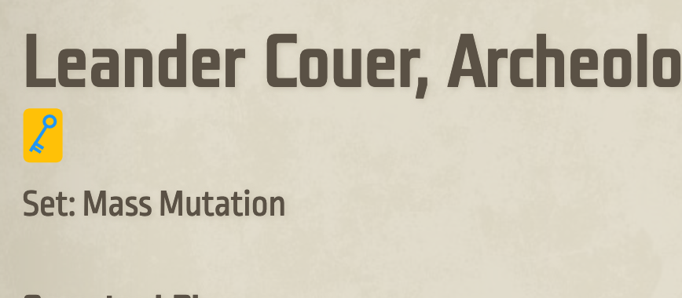

# enhanced vault
This is collection of Greasemonkey userscripts that enhanced the functionalities of the official [Keyforge website](https://www.keyforgegame.com).

## What is Greasemonkey?
[Greasemonkey](https://www.greasespot.net/) is a Firefox extension that allows anyone to customize the way webpages look and function. For those not using Firefox, [Tampermonkey](https://www.tampermonkey.net/) is a valid alternative that works on Chrome, Edge, Safari, Next (as well as Firefox). I personally prefer Greasemonkey over Tampermonkey (as Greasemonkey is an [open source project](https://github.com/greasemonkey/greasemonkey/)), but I test all my scripts on both extensions, on Firefox and Chrome. Whenever I refer to Greasemonkey, I implicitly include Tampermonkey, unless otherwise stated. 

Greasemonkey is a great way for tinkerers to add new features to any website and to share such features with others -- hence this repository :)

## Available scripts

I will be adding new scripts from time to time, as I create them. If there is some specific feature you would like to see implemented, I am open to suggestions -- feel free to [open an issue](https://github.com/fgiobergia/enhanced-vault/issues/new).

### vault2dok 
This simple script adds a link to the [Decks of Keyforge](https://decksofkeyforge.com) (DoK) page of any deck opened in the vault. The link is added as a DoK icon below the deck's name. 

